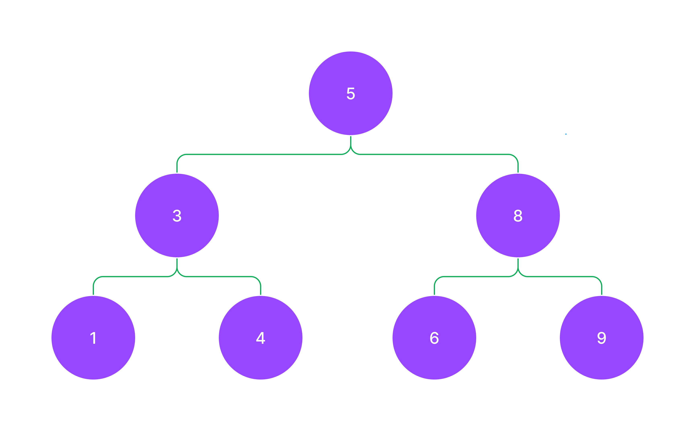

* 현재 repo 주소: https://github.com/paullabkorea/Algorithm-walk-with-wenivs
* 이력서 템플릿: https://paullabworkspace.notion.site/Figma-bfa32213fc244db9b31bb8486a479ee6?pvs=4

# 1. 자료구조와 알고리즘, 코딩테스트
* 자료구조(자료를 어떻게 담는가?): array, object, map, set, 싱글 링크드 리스트, 더블 링크드 리스트, 트리, 해쉬 등
* 알고리즘(문제를 어떻게 풀 것인가?): 애라토스테네스의 체, 그리디 알고리즘, 투 포인터, 슬라이딩 윈도우 등 
* 자료구조 + 알고리즘 => 문제 풀이 능력을 보겠다! => 코딩테스트
* 추천 서적
    * 학문적 접근: The Art of Computer Programming(도널드 커누스)
    * 코딩테스트 접근: 파이썬 알고리즘 인터뷰(박상길)
    * 자바스크립트 코딩 테스트 책: 코딩 테스트 합격자 되기 - 자바스크립트 편
* 요즘은 ChatGPT가 이러한 책의 역할을 하고 있습니다. 그래서 https://100.jsalgo.co.kr/ 와 같은 곳에서 문제를 풀어보시면서 자료구조와 알고리즘을 설명해달라고 ChatGPT에게 요청하시면서 공부하시는 방법이 더 효율적입니다.

## 1.1 코테 전 준비사항
1. 회사와 경향 분석!
    * 코테 보는 회사와 회사 유형을 정리하세요.
    * [코딩테스트 경향 정리](https://paullabworkspace.notion.site/446d03bf38df42e19d9fedcf5ceaec61?pvs=4) 해두었습니다.
    * 분석 서비스를 통해 [출제 경향](https://algoview.co.kr/)도 한 번 정리하세요.
2. 플렛폼에 익숙해지자! (프로그래머스, 구름EDU 등)
    * 사용 가능 라이브러리 미리 확인 등
    * 대부분 numpy나 pandas가 사용 가능하지만 간혹가다 라이브러리 제한이 있는 곳도 있습니다. numpy는 python보다 대부분의 경우 속도가 빠릅니다. 크기에 따라 다르지만 100000개 이상의 배열의 연산의 경우 50배 이상의 성능을 보입니다. 순열과 조합은 itertools를 사용하시면 python 아주 쉽게 풀 수 있습니다.
2. 언어 선택(속도 : C++, 풀이 : Python)
    * 요즘은 Lv이 높은 경우가 아니면 속도 체크를 거의 하지 않는 추세입니다.
    * 다른 언어가 메인이셔도 Python 추천 드립니다. 코딩테스트만을 위해 Python을 새로 공부하시는 분들이 많습니다.
3. 코드 스니펫(트리, 검색, 최단경로(예를 들어 다익스트라), 직접 제작한 함수 등), Cheatsheet, A4 용지 준비
    * 코드 스니펫을 만들어둔 레파지토리 fork - [제주코딩베이스캠프](https://github.com/paullabkorea/programmersLv0)
    * 감독관이 없는 경우 [스니펫](https://github.com/paullabkorea/programmersLv0/blob/main/Solution.md)에서 Ctrl + F해서 문제를 풉니다.
    * 시험 전 스니펫을 만들지 말고 하루 한 문제씩(저도 매일 한 문제씩 풉니다.) 또는 버겁다면 일주일에 2 ~ 3문제.
4. 유용한 라이브러리 정리! (collections, itertools(순열, 조합), functools, re, bisect, math 등) - [제주코딩베이스캠프](https://www.youtube.com/channel/UC4GnvNKtuJ4cqWsYjxNxAEQ) 유튜브 채널 확인
    * 유용한 알고리즘 GitHub repo를 검색하고 fork를 떠두는 것도 좋습니다.
    * 면접질문 repo등 다양한 목적에 repo가 있습니다.
5. 기억해두자! 예외처리!
    * 예외처리와 테스트 케이스중 통과 못하는 케이스들은 문제를 많이 풀어보셔야 합니다.
    * 길이가 0이거나 0으로 나누거나 등
6. 속도개선
    * class로 구현
    * 메서드 대신 슬라이싱 구현(슬라이싱은 C로 구현되어 있어 메서드보다 통상 8배정도 빠릅니다.)하세요. 다만 공간복잡도가 상승할 수 있습니다. (리스트.reverse(), reversed(리스트), 리스트[::-1])
    * for문 대신 list comprehension을 사용하세요. 더 빠릅니다.
    * 재귀는 느립니다. 최후의 수단으로 사용하세요.
7. ChatGPT, Copilot 활용
    * 감독관이 없고 검색이 가능하다면 ChatGPT를 활용하세요.(ChatGPT가 활용 불가인 코테도 있습니다. 다만 활용 불가인데 검색이 가능할 경우 형평성 문제가 생겨요.)
    * ChatGPT 나오고 화이트보드 테스트가 많아졌습니다.

## 1.2 문제 유형과 출제 방식
* 5 ~ 6시간, 6 ~ 7문제
    * 구현 테스트의 경우에는 짧으면 1일 길면 4 ~ 5일 주는 경우도 있습니다.
* 30분씩 4문제, 2시간씩 2문제
* 2 ~ 3시간, 3 ~ 5문제
* 30분씩 3 ~ 4문제, 변별력 1문제
* 단기 공부로 붙을 수 있는 코테와 붙기 힘든 코테 경향 정리
* 문제 유형 분석 관련 글
    * [문제 유형 분석](https://www.hanbit.co.kr/media/channel/view.html?cms_code=CMS4385594264)
    * [언어 유불리 여부](https://www.hanbit.co.kr/media/channel/view.html?cms_code=CMS9145550324&cate_cd=)
    * [코딩 테스트에 가장 많이 출제 되는 알고리즘](https://www.hanbit.co.kr/media/channel/view.html?cms_code=CMS7793635735&cate_cd=)
        * 요구사항 구현 알고리즘(33%)
        * 그리디 알고리즘(20%)
        * 너비우선탐색, 깊이우선탐색(20%)
        * 정렬(8%)
        * 다이나믹 프로그래밍, 최단경로, 이진 탐색 등
* 전체 문제 유형
    * 알고리즘
        * 정렬
        * 이진 검색
        * 비트 연산
        * 슬라이딩 윈도우, 페이지 교체
        * 분할 정복
            * 그리디 알고리즘
            * 다이나믹 프로그래밍
    * 자료구조
        * 선형
            * 스택과 큐, 데크
            * 연결리스트, 해시 테이블
        * 비선형
            * 그래프(최단경로) - 다익스트라가 나오면 매우 어려운 문제
            * 트리
                * 힙
                * 트라이

## 1.3 간단한 코드 스니펫
```js
// 1. python에서 유용한 코드를 js 모듈화

// 1.1. 묶음
const zip = (a, b) => a.map((e, i) => [e, b[i]]);
// 제약조건: a가 map을 사용하기 위해 array여야 합니다.

// 1.2. 범위안에 수 생성
const range = (start, end) => Array.from({length: end - start + 1}, (_, i) => start + i);

Array.from('hello'); // ['h', 'e', 'l', 'l', 'o']
Array.from({'one':10, 'two':20}, (v, i) => i);
Array.from({'one':10, 'two':20}, (v, i) => 'hello');
Array.from({'one':10, 'two':20, length: 3}, (v, i) => 'hello');
Array.from({1, 2, 3});
Array.from([1, 2, 3]);
Array.from(new Set([1, 2, 3]));
Array.from(new Map([[1, 2], [3, 4]]));

Array.from([1, 2, 3], x => x + x); // [2, 4, 6]
Array.from('hello', x => x + x); // ['hh', 'ee', 'll', 'll', 'oo']

// 1.3. 평평하게 만들기(평탄화)
// [1, [2, [3, [4]]]] => [1, 2, 3, 4]
const flatten = (arr, depth = Infinity) => arr.flat(depth);

[1, [2, [3, [4]]]].flat()
[1, [2, [3, [4]]]].flat(1)
[1, [2, [3, [4]]]].flat(2)
[1, [2, [3, [4]]]].flat(3)
[1, [2, [3, [4]]]].flat(Infinity)


// 2. js에서 사용할 유용한 코드
Array(5).fill(0); // [0, 0, 0, 0, 0]
Array(5).fill(0).map((v, i) => i); // [0, 1, 2, 3, 4]
Array(5).fill(0).map((v, i) => i+1); // [1, 2, 3, 4, 5]
'.'.repeat(5)
'.'.repeat(5).split('.') // 권하진 않습니다.
Array.from('ab'.repeat(5))

Infinity
-Infinity

Math.ceil(1.1); // 올림
Math.floor(1.1); // 내림
Math.max(1, 2, 3, 4, 5);
Math.max([1, 2, 3, 4, 5]);
Math.max(...[1, 2, 3, 4, 5]); // 이렇게 종종 사용합니다.

parseInt('1234', 10); // 10진수 1234를 10진수로 변환
parseInt('1001', 2); // 2진수 1001을 10진수로 변환
parseInt('12aa34.abc'); // 12까지 변환, 안전합니다.

Math.floor(10 / 3);
~~(10 / 3) // 안전한 parseInt 연산을 사용하세요.
10 / 3 | 0 // 안전한 parseInt 연산을 사용하세요.
10 / 3 << 0 // 안전한 parseInt 연산을 사용하세요.

2 << 2 // 8
// step1 왼쪽에 있는 2를 2진수로 변환합니다. 10이 됩니다.
// step2 10을 왼쪽으로 2칸 이동합니다. 1000이 됩니다.
// step3 1000을 10진수로 변환합니다. 8이 됩니다.

5 << 3
// step1 왼쪽에 있는 5를 2진수로 변환합니다. 101이 됩니다.
// step2 101을 왼쪽으로 3칸 이동합니다. 101000이 됩니다.
// step3 101000을 10진수로 변환합니다. 40이 됩니다.

(1234.56789).toFixed(2); // 1234.57
(1234.56789).toFixed(0); // 1235
(1234.56789).toFixed(4); // 1234.5679
(1234.56789).toFixed(6); // 1234.567890

// match는 문자열에서 정규식을 사용할 수 있습니다.
'2345678910111213'.match(/1/g) // g는 global이에요. 전역에서 찾겠다는 것입니다. 앞에 슬러시와 뒤에 슬러시는 정규식을 사용할 때 사용합니다.
'2345678910111213'.match('1')
'2345678910111213'.match(/1/)
'2345678910111213'.match(/1/g)
'2345678910111213'.match(/1/g).length
'hello leehojun my name hojun'.match(/hojun/g).length
```

## 1.4 2진수, 8진수, 16진수, 10진수
```js
// 2진수: 숫자를 2개만 사용합니다.
// 0, 1, 10, 11, 100, 101, 110, 111, 1000, 1001, 1010

// 8진수: 숫자를 8개만 사용합니다.
// 0, 1, 2, 3, 4, 5, 6, 7, 10

// 16진수: 숫자를 16개만 사용합니다.
// 0, 1, 2, 3, 4, 5, 6, 7, 8, 9, A, B, C, D, E, F, 10

// 10진수: 숫자를 10개만 사용합니다.
// 0, 1, 2, 3, 4, 5, 6, 7, 8, 9, 10

// 아주 쉽게 10진수를 2진수로 변환하는 방법
// 9를 2진수로 표현해주세요!
// step1 9와 가장 가까운 2의 제곱수를 찾습니다. 2^3 = 8 이 수의 형태는 항상 10000...형태가 됩니다. 1000
// step2 8에서 몇을 더하면 9가 되는지 찾습니다. 1만 더하면 됩니다. 1001
```

## 1.5 워밍업 문제 1
- 문제이름: 8의 갯수 카운팅하기
- 링크: https://codingdojang.com/scode/393
```js
// 이렇게 풀지 마세요 - 1
// xxx8:000 ~ 999개
// xx8x:000 ~ 999개
// x8xx:000 ~ 999개
// 8xxx:000 ~ 999개
// 중복 => 중복을 허락해야 합니다. 4000개가 답이 맞습니다. 
// 이런식으로 풀이하는 것을 보려고 하는 문제가 아닙니다!

// 이렇게 풀지 마세요 - 2
// 이런 카운팅 하는 문제에 lv1문제는 대부분 문자열 문제입니다.
// [0, 0, 0, 0] ~ [9, 9, 9, 9] 반복을 돌며 풀지 마세요.

// 이렇게 풀지 마세요 - 3
count = 0;
for (let i of '12345678910111213') {
    console.log(i);
    if (i === '1'){
        count++;
    }
}
count

// 최대한 내장 메서드를 이용해주세요.
// 효율적으로 풀 수 있는 방법을 찾아주세요.

'12345678910111213'.match(/1/g).length

Array(100)
.fill(0)
.map((_, i) => i)

Array(100)
.fill(0)
.map((_, i) => i)
.join('')

Array(100)
.fill(0)
.map((_, i) => i)
.join('')
.split('')
.filter(v => v === '1')

Array(100)
.fill(0)
.map((_, i) => i)
.join('')
.split('')
.filter(v => v === '1')
.length

// 모든 것을 다 한줄로 만들려는 것은 좋지 않습니다.

Array(100)
.fill(0)
.map((_, i) => i)
.join('')
.match(/1/g)
.length
```

## 1.6 워밍업 문제 2
- 문제이름: 최단거리 구하기
- 링크: https://codingdojang.com/scode/408
- 순서쌍, 최댓값, 최솟값, 특정값의 정렬 문제는 모두 정렬문제입니다.

```js
const s = [1, 3, 4, 8, 13, 17, 20];

// 이렇게 풀지 마세요 - 1
let min = Infinity;
let index = 0;
for (let i = 0; i < s.length - 1; i++) {
    console.log(s[i+1] - s[i]);
    if (s[i+1] - s[i] < min) {
        min = s[i+1] - s[i];
        index = i;
    }
}

console.log(s[index], s[index+1]);

// 최솟값: 최댓값을 먼저 저장해야합니다.
// 최댓값: 최솟값을 먼저 저장해야합니다.

////////////////

// 이렇게 풀면 간단합니다.
const s = [1, 3, 4, 8, 13, 17, 20];
const zip = (a, b) => a.map((e, i) => [e, b[i]]);
const pair = zip(s, s.slice(1));

// 이 상태에서 정렬을 하고 최솟값을 찾으면 됩니다.
pair.sort((a, b) => a[1] - a[0] - (b[1] - b[0]))
pair.sort((a, b) => a[1] - a[0] - (b[1] - b[0]))[0]

////////////////

const s = [1, 3, 4, 8, 13, 17, 20];
const zip = (a, b) => a.map((e, i) => [e, b[i]]);
const pair = zip(s, s.slice(1));
let min = Infinity;
let result = [];

for (let [i, j] of pair) {
    console.log(i, j);
    if (j - i < min) {
        min = j - i;
        result = [i, j];
    }
}

console.log(result);
```

## 1.7 워밍업 문제 3
- 문제이름: 쿠키
- 링크: https://100.jsalgo.co.kr/?page=4#

```js
// ['쿠키 3개', '쿠키 2개', '쿠키 5개']
// 3 X 1 + 2 X 2 + 5 X 3 = 3 + 4 + 15 = 22

const cookies = ['쿠키 3개', '쿠키 2개', '쿠키 5개'];

function solution(data){
    data.forEach(v => {
        console.log(v);
        // console.log(parseInt(v))
        // 숫자가 먼저 나오지 않으면 못찾습니다.
    });
}

solution(cookies);

////////////////

const cookies = ['쿠키 3개', '쿠키 2개', '쿠키 5개'];

function solution(data){
    let result = 0;
    let temp = 1;
    data.forEach(v => {
        console.log(v.match(/\d+/g));
        result += parseInt(v.match(/\d+/g)[0]) * temp;
        temp++;
    });
    return result;
}

solution(cookies);

////////////////

const cookies = ['쿠키 3개', '쿠키 2개', '쿠키 5개'];

function solution(data){
    let result = 0;
    let temp = 1;
    data.forEach(v => {
        result += parseInt(v.split(' ')[1]) * temp;
        temp++;
    });
    return result;
}

solution(cookies);
```

## 1.8 워밍업 문제 4
- 문제이름: 평균점수 카운팅
- 링크: https://100.jsalgo.co.kr/?page=11#

```js
function solution(data){
    let result = 0; // 80점 이상인 학생 수
    data.forEach(v => {
        let mean = 0; // 각 학생의 평균
        v.forEach(i => {
            mean += i;
        });
        mean /= v.length;
        if (mean >= 80) {
            result++;
        }
    });
    return result;
}

solution([[92, 85, 97], [30, 21, 60], [90, 99, 98], [0, 0, 0], [81, 80, 88]])

////////////////

function solution(data){
    let mean = 0; // 각 학생의 평균
    let result = 0; // 80점 이상인 학생 수
    data.forEach(v => {
        mean = v.reduce((acc, cur) => acc + cur) / v.length;
        if (mean >= 80) {
            result++;
        }
    });
    return result;
}

solution([[92, 85, 97], [30, 21, 60], [90, 99, 98], [0, 0, 0], [81, 80, 88]])

////////////////

[10, 20, 30].reduce((a, c) => {
    console.log(`a: ${a}`);
    console.log(`c: ${c}`);
    return a + c;
}, 0)

////////////////

[10, 20, 30, 40, 50].reduce((a, c) => a + c)
[92, 85, 97].reduce((a, c) => a + c)
[].reduce((a, c) => a + c)

[10, 20, 30].reduce((a, c) => a + c, 0)

////////////////

[10, 20, 30, 40, 50].filter(v => v >= 30)

function 함수(값){
    return 값 >= 30;
}

[10, 20, 30, 40, 50].filter(함수)

////////////////

// filter, reduce, length를 사용해서 문제를 풀어보세요!
// 답은 라운지에 올려주시면 됩니다!
// 10분 드리도록 하겠습니다!

// 메서드로 푸는 것을 왜 강조할까요?
// 검증된 메서드, 가독성, 코드의 효율성, 코드의 안정성
// 다른 언어로 개발할 때도 메서드가 거의 동일하게 사용됩니다.

// function solution(data){
//     return data.filter(데이터 => 데이터 > 80)
// }

function solution(data){
    return data.filter(v => v.reduce((a, c) => a + c, 0) >= 240).length;
}


solution([[92, 85, 97], [30, 21, 60], [90, 99, 98], [0, 0, 0], [81, 80, 88]])
```

## 1.9 워밍업 문제 5
- 문제이름: 비트 치환 문제
- 링크: https://100.jsalgo.co.kr/?page=30#

```js
//  9.toString()
//  (9).toString()

// let a = 9;
// a.toString();

let a = 9;
a.toString(2);

////////////////

// 이런 풀이를 권하지 않습니다.
function solution(data){
    let result = '';
    for (let s of data.toString(2)) {
        console.log(s);
        if (s === '1') {
            result += 'A';
        } else {
            result += 'B';
        }
    }
    return result;
}

solution(9);

////////////////

(9).toString(2)
(9).toString(2).replace(/1/g, 'A')
(9).toString(2).replace(/1/g, 'A').replace(/0/g, 'B')

function solution(data){
    return data.toString(2).replace(/1/g, 'A').replace(/0/g, 'B');
}

solution(9);
```

## 1.10 워밍업 문제 6
- 문제이름: 중복된 숫자 갯수
- 링크: https://school.programmers.co.kr/learn/courses/30/lessons/120583

```js
function solution(array, n) {
    let answer = 0;
    for (let i of array) {
        if (i === n) {
            answer++;
        }
    }
    return answer;
}

solution([1, 2, 3, 4, 5, 1, 2, 3, 4, 5], 3);

////////////////

function solution(array, n) {
    let answer = 0;
    for (let i of array) if (i === n) answer++;
    return answer;
}

////////////////

function solution(array, n) {
    return array.filter(v => v === n).length;
}
```

## 1.11 워밍업 문제 7
- 문제이름: 머쓱이보다 키 큰 사람
- 링크 : https://school.programmers.co.kr/learn/courses/30/lessons/120585

```js
// 풀이시간: 10분
// 답은 라운지에 가려서(||```js <코드> ```||) 올려주세요.
// 바로 위에 있는 코드 참고하시면 됩니다.

function solution(array, height) {
    return array.filter(v => v > height).length;
}

solution([175, 180, 165, 170, 185], 175);


////////////////

function solution(array, height) {
    array.sort((a, b) => b - a);
    let index = array.findIndex(h => h <= height);

    if (index === -1) return array.length;
    return index;
}

solution([175, 180, 165, 170, 185], 175);

////////////////

[175, 180, 165, 170, 185].map(v => v > 175)
[175, 180, 165, 170, 185].map(v => v > 175? true : false)
[175, 180, 165, 170, 185].map(v => v > 175? 1 : 0)

function solution(array, height) {
    let arr = array.map(v => v > height);
    return arr.reduce((a, c) => a + c, 0);
}

solution([175, 180, 165, 170, 185], 175)
```

## 1.12 워밍업 문제 8
- 문제이름: 자릿수 더하기
- 링크 : https://school.programmers.co.kr/learn/courses/30/lessons/120906


```js
(123).toString().split('')
(123).toString().split('').map(v => parseInt(v))
(123).toString().split('').map(v => parseInt(v)).reduce((a, c) => a + c, 0)
(123).toString().split('').reduce((a, c) => a + c)
(123).toString().split('').reduce((a, c) => a + c, 0)
(123).toString().split('').reduce((a, c) => a + parseInt(c), 0)
(123).toString().split('').reduce((a, c) => a + parseInt(c)*2, 0)

// 비교
(123).toString().split('').map(v => parseInt(v)).reduce((a, c) => a + c, 0)
(123).toString().split('').reduce((a, c) => a + parseInt(c), 0)


function solution(n) {
    return n
        .toString()
        .split('')
        .reduce((a, c) => a + parseInt(c), 0);
}

solution(123);
```

# 2. 기본 자료구조와 알고리즘

1. 스택과 큐
2. 연결리스트
3. 트리와 그래프
    - 3.1 트리 구현
    - 3.2 트리의 순회
4. 정렬 알고리즘
    - 4.1 선택정렬
    - 4.2 삽입정렬
    - 4.3 병합정렬
    - 4.4 퀵정렬
5. 페이지 교체 알고리즘
6. 슬라이딩 윈도우와 투 포인터 알고리즘

* (학문적 접근이 아니라면 잠시 이해를 미뤄두세요.) ADT(Abstract Data Type): 스택이라는 자료형을 구현한다고 했을 때, 구현해야할 메서드 명, 멤버 변수 등을 정의한 것을 말합니다. [위키디피아](https://ko.wikipedia.org/wiki/%EC%8A%A4%ED%83%9D)에 정의되어 있는 stack을 한 번 확인해보세요.

## 2.1 스택과 큐
### 2.1.1 스택과 큐의 개념
    * 스택: LIFO(Last In First Out), 가장 최근에 들어온 데이터가 가장 먼저 나가는 구조
    * 큐: FIFO(First In First Out), 가장 먼저 들어온 데이터가 가장 먼저 나가는 구조
    * 스택과 큐 간단한 문제
        * 다음중 스택이 될 수 없는 것은? 스택에 들어가는 값은 1, 2, 3, 4, 5이다. (4번)
            * 1. 1, 2, 3, 4, 5
            * 2. 3, 2, 4, 5, 1
            * 3. 4, 3, 2, 5, 1
            * 4. 1, 5, 4, 2, 3
    * 이게 왜 중요하죠? 왜 이렇게나 많은 시험에서 나오고 있을까요?
        * 예를 들어서 컴퓨터에서 프로그램을 호출하면 스택에 쌓이게 됩니다. 만약에 문서 작업을 하다가, 게임을 하다가, 인터넷 서핑을 하다가, 넷플릭스를 보았습니다. 그러면 넷플릭스를 종료시켰을 때 무엇이 나와야 할까요? `Alt + Tab`을 사용했을 때에도 마찬가지입니다. 최근에 사용한 것이 나오죠. 이런 것들이 모두 스택과 큐라는 개념을 사용합니다.
    * JavaScript에서는 이게 왜 또 중요하죠?
        * JavaScript에서도 프로그래밍을 할 때, 특히 Array 작업을 할 때 데이터를 넣고 빼는 작업을 할 때 스택과 큐를 사용합니다.

### 2.1.2 스택과 큐의 구현
```js
// 스택 1번째 구현, 뒤에서 넣고 뒤에서 빼는 스택
// 만약에 앞에서 빼면 스택이 깨지는 것이죠. 
// 할 수 있는데 스택을 유지하기 위해 안하는 겁니다.
let stack = [];
stack.push(1);
stack.push(2);
stack.push(3);
stack.pop();
console.log(stack);

// 스택 2번째 구현, 앞에서 넣고 앞에서 빼는 스택
// 보통은 1번을 많이 사용합니다.
let stack = [];
stack.unshift(1);
stack.unshift(2);
stack.unshift(3);
stack.shift();
console.log(stack);

// 큐 1번째 구현, 뒤에서 넣고 앞에서 빼는 큐
let queue = [];
queue.push(1);
queue.push(2);
queue.push(3);
queue.shift();
console.log(queue);

// 큐 2번째 구현, 앞에서 넣고 뒤에서 빼는 큐
let queue = [];
queue.unshift(1);
queue.unshift(2);
queue.unshift(3);
queue.pop();
```

### 2.1.3 스택과 큐의 문제
* 문제 링크 : https://jsalgo.co.kr/?page=6#
```js
// 이 문제를 슬라이싱으로 풀면 아래 예제에서 오답이 나옵니다.
// [1, 2, 3, 4, 1, 2, 3, 4, 1, 2, 3, 4, 1]
// [1, 2, 3, 4, 5, 6, 7, 8, 9].slice(-5)
// [5, 6, 7, 8, 9] == [1, 2, 3, 4, 5, 6, 7, 8, 9].slice(-5)
// JSON.stringify([5, 6, 7, 8, 9]) == JSON.stringify([1, 2, 3, 4, 5, 6, 7, 8, 9].slice(-5))

// const comp = JSON.stringify
// comp([5, 6, 7, 8, 9]) == comp([1, 2, 3, 4, 5, 6, 7, 8, 9].slice(-5))

function solution(data){
    let stack = [];
    let sandwich_count = 0;
    for (let i of data) {
        stack.push(i);
        if (JSON.stringify(stack.slice(-5)) === JSON.stringify([1, 2, 3, 4, 1])) {
            stack.splice(-5);
            sandwich_count++;
        }
    }
    return sandwich_count;
}

solution([1, 2, 3, 4, 1, 2, 3, 4, 1, 2, 3, 4, 1]);
```

## 2.2 연결리스트
### 2.2.1 연결리스트의 개념
* 연결리스트는 보통 메모리 효율을 위해 사용합니다.
* 주로 데이터 부분과 다음 노드를 가리키는 포인터로 구성되어 있습니다.
* 뒤에서 할 모든 트리, 그래프 등의 심화 문제는 이 연결리스트가 기반이 됩니다.
* 개념 : https://en.wikipedia.org/wiki/Linked_list
* 알고리즘 시각화 : https://visualgo.net/ko

### 2.2.2 연결리스트의 구현
* 여러분이 가장 친숙한 자료형으로 링크드리스트를 구현하고, 천천히 난이도를 높여가보도록 하겠습니다.

#### 2.2.2.1 step1
* object로 linked list를 구현합니다.
```js
// head -> 12 -> 99 -> 37

const linkedList = {
    head: {
        data: 12,
        next: {
            data: 99,
            next: {
                data: 37,
                next: null
            }
        }
    }
}

console.log(linkedList['head'])
console.log(linkedList.head)
linkedList.head.data
linkedList.head.next.data
linkedList.head.next.next.data

// 이렇게 해서 뭐가 좋은가요? array로 그냥 [12, 99, 37] 이렇게 만들면 편하지 않나요?
// 아래 이미지를 확인해보세요.
// https://www.mathwarehouse.com/programming/gifs/binary-search-tree.php#binary-search-tree-insertion-node
```

#### 2.2.2.2 step2
* object로 linked list를 구현합니다.
* 다만 계층적 구조를 분리해 깔끔하게 만듭니다.
```js
let linkedList = {head: null};
let node1 = {data: 12, next: null};
let node2 = {data: 99, next: null};
let node3 = {data: 37, next: null};

node1.next = node2;
node2.next = node3;

linkedList.head = node1;

console.log(linkedList.head.data);
console.log(linkedList.head.next.data);
console.log(linkedList.head.next.next.data);
```

#### 2.2.2.3 step3
* object로 linked list를 구현합니다.
* 이번에는 순회를 해보겠습니다.
```js
let linkedList = {head: null};
let node1 = {data: 10, next: null};
let node2 = {data: 20, next: null};
let node3 = {data: 30, next: null};
let node4 = {data: 40, next: null};
let node5 = {data: 50, next: null};

node1.next = node2;
node2.next = node3;
node3.next = node4;
node4.next = node5;

linkedList.head = node1;

let current = linkedList.head;
while (current){
    console.log(current.data);
    current = current.next;
}
```

#### 2.2.2.4 step4
* object로 linked list를 구현합니다.
* 이번에는 search를 합니다. 40이라는 값의 인덱스를 반복문 안에서 찾아야 합니다.(https://visualgo.net/en/list?slide=1)
* 구현 시간은 8분을 드렸습니다. 가려서 라운지에 올려주세요.
```js
let linkedList = {head: null};
let node1 = {data: 10, next: null};
let node2 = {data: 20, next: null};
let node3 = {data: 30, next: null};
let node4 = {data: 40, next: null};
let node5 = {data: 50, next: null};

node1.next = node2;
node2.next = node3;
node3.next = node4;
node4.next = node5;

linkedList.head = node1;

let current = linkedList.head;
let index = 0;
while (current){
    console.log(index);
    if (current.data === 40){
        break;
    }
    current = current.next;
    index++;
}
console.log(index);
```

#### 2.2.2.5 step5
* class로 linked list를 구현합니다.
* 이번 챕터는 노드만 구현합니다.
```js
class Node {
    constructor(data){
        this.data = data;
        this.next = null;
    }
}

node1 = new Node(10);
node2 = new Node(20);
node3 = new Node(30);
head = node1;

node1.next = node2;
node2.next = node3;
```

#### 2.2.2.6 step6
* class로 linked list를 구현합니다.
* 이번 챕터에서는 자동으로 값이 연결되게 합니다.
```js
class Node {
    constructor(data){
        this.data = data;
        this.next = null;
    }
}

class LinkedList {
    constructor(){
        let init = new Node("init");
        this.head = init;
        this.tail = init;
    }

    push(data){
        let newNode = new Node(data);
        // 마지막 값은 새로운 노드가 되어야 합니다.
        this.tail.next = newNode;
        // 마지막 노드는 새로운 노드가 되어야 합니다.
        this.tail = newNode;
    }
}

l = new LinkedList();
l.push(10);
l.push(20);
l.push(30);
l.push(40);

console.log(l.head.next.next.data);
console.log(l.head.next.next.next.data);
```

#### 2.2.2.7 step7
* class로 linked list를 구현합니다.
* legth와 toString을 구현합니다.
```js
class Node {
    constructor(data){
        this.data = data;
        this.next = null;
    }
}

class LinkedList {
    constructor(){
        let init = new Node("init");
        this.head = init;
        this.tail = init;
        this.length = 0;
        this.displayData = '';
    }

    push(data){
        let newNode = new Node(data);
        this.tail.next = newNode;
        this.tail = newNode;
        this.length++;
        this.displayData += `${data}, `;
    }

    toString(){
        return `<${this.displayData.slice(0, -2)}>`;
    }
}

l = new LinkedList();
l.push(10);
l.push(20);
l.push(30);
l.push(40);

l.toString();
```

#### 2.2.2.8 step8
* class로 linked list를 구현합니다.
* toString을 앞에서 object로 했던 것처럼 순회해서 구현합니다.
```js
class Node {
    constructor(data){
        this.data = data;
        this.next = null;
    }
}

class LinkedList {
    constructor(){
        let init = new Node("init");
        this.head = init;
        this.tail = init;
        this.length = 0;
    }

    push(data){
        let newNode = new Node(data);
        this.tail.next = newNode;
        this.tail = newNode;
        this.length++;
    }

    toString(){
        // this.head가 init이기 때문에
        let current = this.head.next;
        let result = '';
        while (current){
            result += `${current.data}, `;
            current = current.next;
        }
        return `<${result.slice(0, -2)}>`;
    }
}

l = new LinkedList();
l.push(10);
l.push(20);
l.push(30);
l.push(40);

l.toString();
```

#### 2.2.2.9 step9
* class로 linked list를 구현합니다.
* 데이터를 삽입하는 insert를 구현합니다.
```js
class Node {
    constructor(data){
        this.data = data;
        this.next = null;
    }
}

class LinkedList {
    constructor(){
        let init = new Node("init");
        this.head = init;
        this.tail = init;
        this.length = 0;
    }

    push(data){
        let newNode = new Node(data);
        this.tail.next = newNode;
        this.tail = newNode;
        this.length++;
    }

    toString(){
        // this.head가 init이기 때문에
        let current = this.head.next;
        let result = '';
        while (current){
            result += `${current.data}, `;
            current = current.next;
        }
        return `<${result.slice(0, -2)}>`;
    }

    insert(index, data){
        let current = this.head.next;
        for (let i = 0; i < index - 1; i++){
            current = current.next;
        }
        let newNode = new Node(data);
        newNode.next = current.next;
        current.next = newNode;
        this.length++;
    }
}

l = new LinkedList();
l.push(10);
l.push(20);
l.push(30);
l.push(40);
l.insert(2, 100);

l.toString();
```

### 2.2.3 연결리스트의 종류
* Singly linked list
* Doubly linked list
* Circular linked list

#### 2.2.3.1 Doubly linked list 형태

```js
const list = {
    head: null,
};

let list1 = { data: 12, next: null, pre: null };
let list2 = { data: 99, next: null, pre: null };
let list3 = { data: 37, next: null, pre: null };
let list4 = { data: 2, next: null, pre: null };

list.head = list1;
list1.next = list2;
list2.next = list3;
list3.next = list4;

list1.pre = list;
list2.pre = list1;
list3.pre = list2;
list4.pre = list3;

list1.next.next.data;
// 37
list3.pre.pre.data;
// 12
list4.pre.pre.pre.next.next.data;
// 37
```

```js
class Node {
    constructor(data) {
        this.data = data;
        this.next = null;
        this.pre = null;
    }
}

class DoubleLinkedList {
    constructor() {
        let init = new Node("init");
        this.head = init;
        this.tail = init;
    }

    append(data) {
        let 새로운노드 = new Node(data);

        this.tail.next = 새로운노드;
        새로운노드.pre = this.tail;

        this.tail = 새로운노드;
    }
}

l = new DoubleLinkedList();
l.append(1);
l.append(2);
l.append(3);
l.append(10);
l.append(20);
l.append(30);
```

## 쉬어가기 연습문제
* 문제 링크 : https://school.programmers.co.kr/learn/courses/30/lessons/120844
```js
// rotate 문제입니다.
// 이러한 문제는 이어붙이기로 쉽게 풀이가 가능할 수 있습니다.
// [1, 2, 3] + [1, 2, 3] => '1,2,31,2,3'
// [...arr, ...arr2] => [1, 2, 3, 1, 2, 3]
function solution(data, direction){
    if (direction === "right"){
        const temp = data.pop();
        data.unshift(temp);
        return data;
    } else {
        const temp = data.shift();
        data.push(temp);
        return data;
    }
}

function solution(numbers, direction) {
    if (direction === 'right'){
        numbers = [numbers.pop(), ...numbers]
    } else {
        numbers = [...numbers.slice(1), numbers.shift()]
    }
    return numbers
}

function solution(data, direction){
    return direction === "right" ? [data.pop(), ...data] : [...data.slice(1), data.shift()]
}

function solution(data, direction){
    const total = [...data, ...data];
    if (direction === "right"){
        return total.slice(data.length-1, -1);
    } else {
        return total.slice(1, 1+data.length);
    }
}

solution([1, 2, 3], "right");
```

* 문제 링크 : https://school.programmers.co.kr/learn/courses/30/lessons/120864
```js
// 특정 패턴 찾는 문제
// "aAb1B2cC34oOp" => 37
// "1a2b3c4d123Z" => 133

// isNaN("1") => false
// 틀린 답변, 왜냐하면 2자리, 3자리 등을 못찾습니다.
function solution(s){
    let result = 0;
    for (let i of s){
        if (!isNaN(i)){
            result += parseInt(i);
        }
    }
    return result;
}

solution("aAb1B2cC34oOp")

// 정규표현식 중 숫자만 찾는 방법
// "aAb1B2cC34oOp".match(/\d+/g)
// ["1", "2", "34"]

function solution(s) {
    return s.match(/\d+/g).reduce((a, c) => a + parseInt(c), 0);
}
solution("aAb1B2cC34oOp")
```

## 2.3 트리와 그래프
### 2.3.1 트리의 기본 형태
```js
// 이진 트리의 기본형태
// data
// child - left
// child - right
const tree = {
    root: {
        data: 5,
        left: {
            data: 3,
            left: null,
            right: null,
        },
        right: {
            data: 8,
            left: null,
            right: null,
        },
    },
};
```
### 2.3.2 트리의 구현
* 위 형태를 참고해서 트리를 만들어주세요.
    - 우리가 구현할 트리
        
    - 어제 했던 것처럼 object로 구현하셔도 되고, class로 구현하셔도 됩니다.
    - 시간은 10분입니다.
```js
const tree = {
  root: {
    value: 5,
    left: {
      value: 3,
      left: {
        value: 1,
        left: null,
        right: null
      },
      right: {
        value: 4,
        left: null,
        right: null
      }
    },
    right: {
      value: 8,
      left: {
        value: 6,
        left: null,
        right: null
      },
      right: {
        value: 9,
        left: null,
        right: null
      }
    }
  }
}
tree.root.value
5
tree.root.left.value
3
tree.root.left.left.value
1
tree.root.left.right.value
4
tree.root.right.value
8
tree.root.right.left.value
6
tree.root.right.right.value
9
```

```js
class Node {
  constructor(data) {
    this.data = data;
    this.left = null;
    this.right = null;
  }
}
let node1 = new Node(5);
let node2 = new Node(3);
let node3 = new Node(8);
let node4 = new Node(1);
let node5 = new Node(4);
let node6 = new Node(6);
let node7 = new Node(9);

let root = node1;
node1.left = node2;
node1.right = node3;
node2.left = node4;
node2.right = node5;
node3.left = node6;
node3.right = node7;

root.right.left.data;
```

* 트리의 class 구현 - 1 (데이터 추가)
    * 완벽한 트리를 구현하는데 목표가 있지 않습니다.
```js
class Node {
  constructor(data) {
    this.data = data;
    this.left = null;
    this.right = null;
  }
}

class Tree {
    constructor(data){
        this.init = new Node(data);
        this.root = this.init;
        this.length = 0; // 노드의 갯수
    }

    add(data){
        let newNode = new Node(data);
        let current = this.root;
        while (current) {
            if (data == current.data) {
                // 들어온 값이 이미 존재하는 값이면 추가하지 않습니다.
                return;
            } else if (data < current.data) {
                // 왼쪽으로 이동해야 합니다.
                // 이동한 곳에 데이터가 비어있으면 데이터를 넣습니다.
                // 이동한 곳에 데이터가 있으면 계속 타고 내려갑니다.
                if (!current.left) {
                    current.left = newNode;
                    this.length++;
                    return;
                }
                current = current.left;
            } else if (data > current.data) {
                // 오른쪽으로 이동해야 합니다.
                // 이동한 곳에 데이터가 비어있으면 데이터를 넣습니다.
                // 이동한 곳에 데이터가 있으면 계속 타고 내려갑니다.
                if (!current.right) {
                    current.right = newNode;
                    this.length++;
                    return;
                }
                current = current.right;
            }
        }
    }
}

let t = new Tree(5);
t.add(3);
t.add(8);
t.add(1);
t.add(4);
t.add(6);
t.add(9);

t.root.data
5
t.root.left.data
3
t.root.right.data
8
t.root.left.left.data
1
```

* 트리의 class 구현 - 2 (트리의 순회)
    * 완벽한 트리를 구현하는데 목표가 있지 않습니다.
```js
class Node {
  constructor(data) {
    this.data = data;
    this.left = null;
    this.right = null;
  }
}

class Tree {
    constructor(data){
        this.init = new Node(data);
        this.root = this.init;
        this.length = 0; // 노드의 갯수
    }

    add(data){
        let newNode = new Node(data);
        let current = this.root;
        while (current) {
            if (data == current.data) {
                // 들어온 값이 이미 존재하는 값이면 추가하지 않습니다.
                return;
            } else if (data < current.data) {
                // 왼쪽으로 이동해야 합니다.
                // 이동한 곳에 데이터가 비어있으면 데이터를 넣습니다.
                // 이동한 곳에 데이터가 있으면 계속 타고 내려갑니다.
                if (!current.left) {
                    current.left = newNode;
                    this.length++;
                    return;
                }
                current = current.left;
            } else if (data > current.data) {
                // 오른쪽으로 이동해야 합니다.
                // 이동한 곳에 데이터가 비어있으면 데이터를 넣습니다.
                // 이동한 곳에 데이터가 있으면 계속 타고 내려갑니다.
                if (!current.right) {
                    current.right = newNode;
                    this.length++;
                    return;
                }
                current = current.right;
            }
        }
    }

    // 깊스너큐
    DFS(){
        // 깊이우선탐색, DFS(Depth First Search)
        // Stack 이용

        let result = []; // 방문경로
        let stack = [this.root];

        while (stack.length !== 0) {
            let current = stack.pop();
            if (current.right) {
                stack.push(current.right)
            };
            if (current.left) {
                stack.push(current.left)
            };
            result.push(current.data);
        }

        return result;
    }

    BFS(){
        // 너비우선탐색, BFS(Breadth First Search)
        // Queue 이용

        let result = []; // 방문경로
        let queue = [this.root];

        while (queue.length !== 0) {
            let current = queue.shift();
            if (current.right) {
                queue.push(current.right)
            };
            if (current.left) {
                queue.push(current.left)
            };
            result.push(current.data);
        }

        return result;
    }
}

let t = new Tree(5);
t.add(3);
t.add(8);
t.add(1);
t.add(4);
t.add(6);
t.add(9);

t.DFS();
t.BFS();
```

## 2.4 정렬 알고리즘
- 재미있는 사실(재미없을 수도 있습니다. 사례를 말씀드릴게요.)
    - JavaScript의 Array의 sort는 알고리즘이 고정이 아닙니다. 각 브라우저마다(벤더사마다) 다른 sort를 사용하고 있어서 같은 값이면 브라우저마다 보여지는 화면이 다를 수 있습니다.
    - Google이 Chrome 70 이전에 개수에 따라 다른 알고리즘을 혼합하는 정렬을 사용했다가(InsertionSort & QuickSort 사용) 얼마전에(18년도에) Timsort로 변경했습니다.
    - 정렬 알고리즘 중에서 가장 인기있는 알고리즘은 병합정렬(존 폰 노이만 제작)이었습니다.
    - Python에서 시작된 Timsort로(팀 피터스) 대동단결하고 있는 모양세입니다. Python 만세!
    - Timsort는 삽입정렬과 병합정렬을 적절히 조합한 것이고, 2002년도에 Python을 위해 C로 구현되었습니다.
    - 정렬 알고리즘 3대장 비교(Bset, Worst)
        - 병합 정렬 : nlogn, nlogn
        - 퀵 정렬 : nlogn, n\*\*2
        - 팀소트 : n, nlogn
- 정렬 알고리즘을 작성할 때 주의사항

### 2.4.1 공간 복잡도와 시간 복잡도
- 시간 복잡도: 얼마나 많은 시간이 걸렸는지
- 공간 복잡도: 얼마나 많은 공간이 필요했는지

```js
// 시간 복잡도 계산
// O(n)
const n = 10;
for (let i = 0; i < n; i++){
    console.log(i);
}

// O(n^2)
const n = 10;
for (let i = 0; i < n; i++){
    for (let j = 0; j < n; j++){
        console.log(i, j);
    }
}

// O(n^3)
const n = 10;
for (let i = 0; i < n; i++){
    for (let j = 0; j < n; j++){
        for (let k = 0; k < n; k++){
            console.log(i, j, k);
        }
    }
}

// O(n)
// 주의!
// O(3n) => O(n)
// 상수는 항상 무시됩니다.
const n = 10;
for (let i = 0; i < n; i++){
    for (let j = 0; j < 3; j++){
        console.log(i, j);
    }
}
```
### 2.4.2 선택정렬

* 선택정렬은 가장 작은 것을 선택해서 앞으로 보내는 정렬입니다.

- step 1
```
전 = [199, 22, 33, 12, 32, 64, 72, 222, 233]
후 = []
```

- step 2

```
전 = [199, 22, 33, 32, 64, 72, 222, 233]
후 = [12]
```

- step 3

```
전 = [199, 33, 32, 64, 72, 222, 233]
후 = [12, 22]
```

- step 4

```
전 = [199, 33, 64, 72, 222, 233]
후 = [12, 22, 32]
```

- step 5

```
전 = [199, 64, 72, 222, 233]
후 = [12, 22, 32, 33]
```

- 선택정렬 구현

```js
let 입력값 = [199, 22, 33, 12, 32, 64, 72, 222, 233];
let 정렬된배열 = [];
// let 길이 = 입력값.length // 가변될 수 있는 값을 미리 변수로 선언하는 방식을 사용할 수도 있습니다.
while (!!입력값.toString()) {
    // !! 안해주어도 됩니다.
    let 최솟값 = Math.min(...입력값);
    정렬된배열.push(최솟값);
    입력값.splice(입력값.indexOf(최솟값), 1);
}

console.log(정렬된배열);

// 메서드 최소화된 코드, 새로운 arr를 만들지 않는 코드
// 최솟값 <-> 현재값
let 입력값 = [199, 22, 33, 12, 32, 64, 72, 222, 233];

function selectionSort(arr) {
    // [199, 22, 33, 12, 32, 64, 72, 222, 233]
    // 첫번째 순회
    // min_index = 0
    // 두번째 순회
    // arr[min_index] > arr[j]
    // arr[0] > arr[1] -> min_index = 1
    // arr[1] > arr[2] -> min_index = 1
    // arr[1] > arr[3] -> min_index = 3
    // arr[3] > arr[4] -> min_index = 3
    // arr[3] > arr[5] -> min_index = 3
    // arr[3] > arr[6] -> min_index = 3
    // arr[3] > arr[7] -> min_index = 3
    // arr[0](199) <-> arr[3](12)
    // 순회가 돌면 돌 수록 최솟값이 앞에 배치되게 된다.
    for (let i = 0; i < arr.length; i++) {
        let min_index = i;
        for (let j = i + 1; j < arr.length; j++) {
            if (arr[min_index] > arr[j]) {
                min_index = j;
            }
        }
        let temp = arr[min_index];
        arr[min_index] = arr[i];
        arr[i] = temp;
    }
    return arr;
}

console.log(selectionSort(입력값));
```

### 2.4.3 삽입정렬
* 삽입정렬은 앞에서부터 차례대로 삽입될 위치를 찾아 끼어들기 하는 정렬입니다.

- step 1
```
전 = [199, 22, 33, 12, 32, 64, 72, 222, 233]
후 = []
```

- step 2
```
전 = [22, 33, 12, 32, 64, 72, 222, 233]
후 = [199]
```

- step 3
```
전 = [33, 12, 32, 64, 72, 222, 233]
후 = [22, 199]
```

- step 4
```
전 = [12, 32, 64, 72, 222, 233]
후 = [22, 33, 199] // 이렇게 껴들려면 껴들 수 있는 index를 알아내야 합니다.
```

- step 5
```
전 = [32, 64, 72, 222, 233]
후 = [12, 22, 33, 199]
```

* 구현코드
```js
let 입력값 = [199, 22, 33, 12, 32, 64, 72, 222, 233];
let 정렬된배열 = [];
let 배열의길이 = 입력값.length;

function 삽입값이_들어갈_인덱스(정렬된배열, 삽입값) {
    for (const i in 정렬된배열) {
        if (삽입값 < 정렬된배열[i]) {
            return i;
        }
    }
    return 정렬된배열.length;
}

for (let i = 0; i < 배열의길이; i++) {
    let 삽입값 = 입력값.shift();
    let 인덱스 = 삽입값이_들어갈_인덱스(정렬된배열, 삽입값);
    정렬된배열.splice(인덱스, 0, 삽입값);
}

console.log(정렬된배열);

// 참고만 하고 가도록 하겠습니다.
function insertIndex(sorted_arr, value) {
    //삽입될 위치를 찾는 함수
    for (let i in sorted_arr) {
        if (value < sorted_arr[i]) {
            return i;
        }
    }
    return sorted_arr.length;
}

function insertSort(arr) {
    let sorted_arr = [];

    while (arr.length != 0) {
        let value = arr.shift();
        //삽입될 위치를 반환함
        let index = insertIndex(sorted_arr, value);
        //삽입될 위치에 값을 반환
        sorted_arr.splice(index, 0, value);
    }
    return sorted_arr;
}
const arr = [199, 22, 33, 12, 32, 64, 72, 222, 233];
console.log(insertSort(arr));

let 입력값 = [199, 22, 33, 12, 32, 64, 72, 222, 233];
let 정렬된배열 = [];
let 배열의길이 = 입력값.length;

function insertIndex(sorted_arr, value) {
    //삽입될 위치를 찾는 함수
    for (let i in sorted_arr) {
        if (value < sorted_arr[i]) {
            return i;
        }
    }
    return sorted_arr.length;
}

function insertSort(arr) {
    let sorted_arr = [];

    while (arr.length != 0) {
        let [value, ...arr2] = arr;
        arr = arr2;
        //삽입될 위치를 반환함
        let index = insertIndex(sorted_arr, value);
        //삽입될 위치에 값을 반환
        sorted_arr.splice(index, 0, value);
    }
    return sorted_arr;
}
const arr = [199, 22, 33, 12, 32, 64, 72, 222, 233];
console.log(insertSort(arr));
```

### 2.4.4 병합정렬
* 병합정렬은 분할정복 알고리즘으로, 배열을 반으로 나누어 정렬하고 합치는 방식입니다.
* Worst와 Best 모두 O(nlogn), 어떤 정렬보다 빠름, 동일 할 수 있음
* 분할 정복(Divide and Conquer)

* step
```
// 분할
[5, 10, 66, 77, 54, 32, 11, 15]
[5, 10, 66, 77], [54, 32, 11, 15]
[5, 10], [66, 77], [54, 32], [11, 15]
[5], [10], [66], [77], [54], [32], [11], [15]

// 정복
[5, 10], [66, 77], [32, 54], [11, 15]
[5, 10, 66, 77], [11, 15, 32, 54]
[5, 10, 11, 15, 32, 54, 66, 77]
```

* 구현코드

- step 1

```js
let 입력값 = [5, 10, 66, 77, 54, 32, 11, 15];

function 병합정렬(입력배열) {
    let 입력배열의길이 = 입력배열.length;
    if (입력배열의길이 <= 1) {
        return 입력배열;
    }
    let 중간값 = parseInt(입력배열의길이 / 2);
    // ~~(입력배열의길이 / 2)와 같습니다.
    let 그룹하나 = 병합정렬(입력배열.slice(0, 중간값));
    let 그룹둘 = 병합정렬(입력배열.slice(중간값));

    return `그룹하나:${그룹하나}\n그룹둘:${그룹둘}\n\n`;
}

console.log(병합정렬(입력값));
```

- step 2

```js
let 입력값 = [5, 10, 66, 77, 54, 32, 11, 15];

function 병합정렬(입력배열) {
    //분할
    let 입력배열의길이 = 입력배열.length;
    let 결과값 = [];
    if (입력배열의길이 <= 1) {
        return 입력배열;
    }
    let 중간값 = parseInt(입력배열의길이 / 2);
    // ~~(입력배열의길이 / 2)와 같습니다.
    let 그룹하나 = 병합정렬(입력배열.slice(0, 중간값));
    let 그룹둘 = 병합정렬(입력배열.slice(중간값));

    // return `그룹하나:${그룹하나}\n그룹둘:${그룹둘}\n\n`;

    //정복
    while (그룹하나.length != 0 && 그룹둘.length != 0) {
        if (그룹하나[0] < 그룹둘[0]) {
            결과값.push(그룹하나.shift());
        } else {
            결과값.push(그룹둘.shift());
        }
    }
    while (그룹하나.length != 0) {
        결과값.push(그룹하나.shift());
    }
    while (그룹둘.length != 0) {
        결과값.push(그룹둘.shift());
    }

    return 결과값;
}

console.log(병합정렬(입력값));
```

* 개선 코드

```js
let 입력값 = [5, 10, 66, 77, 54, 32, 11, 15];

function 병합정렬(입력배열) {
//분할
let 입력배열의길이 = 입력배열.length;
let 결과값 = [];
if (입력배열의길이 <= 1) {
    return 입력배열;
}
let 중간값 = parseInt(입력배열의길이 / 2);
// ~~(입력배열의길이 / 2)와 같습니다.
let 그룹하나 = 병합정렬(입력배열.slice(0, 중간값));
let 그룹둘 = 병합정렬(입력배열.slice(중간값));

// return `그룹하나:${그룹하나}\n그룹둘:${그룹둘}\n\n`;

//정복
while (그룹하나.length != 0 && 그룹둘.length != 0) {
    if (그룹하나[0] < 그룹둘[0]) {
        결과값.push(그룹하나.shift());
    } else {
        결과값.push(그룹둘.shift());
    }
}

//개선된 코드
결과값 = [...결과값, ...그룹하나];
결과값 = [...결과값, ...그룹둘];

return 결과값;
}

console.log(병합정렬(입력값));
```

### 2.4.5 퀵정렬
- best - O(nlog2n), worst - O(n\*\*2)
- 피봇값(pivot)을 기준으로 정렬(피봇값은 처음값, 중간값, 마지막 값)
- 실무에서는 worst일 경우를 피하기 위해 피봇을 랜덤하게 주는 경우나, 피봇을 2개 사용하는 경우도 있음.
*   step
    ```
    // 원본
    [66, 77, 54, 32, 10, 5, 11, 15]

    // step 1
    // 피봇값 : 66
    [54, 32, 10, 5, 11, 15] + [66] + [77]

    // step 2
    // 피봇값 : 54
    [32, 10, 5, 11, 15] + [54] + [66] + [77]

    // step 3
    // 피봇값 : 32
    [10, 5, 11, 15] + [32] + [54] + [66] + [77]

    // step 4
    // 피봇값 : 10
    [5] + [10] + [11, 15] + [32] + [54] + [66] + [77]

    // step 5
    // 피봇값 : 11
    [5] + [10] + [11] + [15] + [32] + [54] + [66] + [77]

    [5, 10, 11, 15, 32, 54, 66, 77]
    ```

*   구현코드

```js
let 입력값 = [66, 77, 54, 32, 10, 5, 11, 15];

function 퀵정렬(입력배열) {
    let 입력배열의길이 = 입력배열.length;

    if (입력배열의길이 <= 1) {
        return 입력배열;
    }

    let 피벗값 = 입력배열.shift();
    let 그룹하나 = [];
    let 그룹둘 = [];

    for (let i in 입력배열) {
        if (입력배열[i] < 피벗값) {
            그룹하나.push(입력배열[i]);
        } else {
            그룹둘.push(입력배열[i]);
        }
    }
    console.log(
        `그룹하나 : ${그룹하나}\n그룹둘 : ${그룹둘}\n피벗값 : ${피벗값}\n`
    );

    return 퀵정렬(그룹하나).concat(피벗값, 퀵정렬(그룹둘));
}

퀵정렬(입력값);
```

### 2.4.6 코딩테스트에 나오는 정렬 유형

```js
data = [
    [23, 33, 'hello world'],
    [42, 11, 'hello wo'],
    [33, 25, 'hello wor'],
    [11, 12, 'hello worl'],
    [82, 23, 'hello'],
]

// 0번째 인덱스로 정렬
data.sort((a, b) => a[0] - b[0]);
data.sort((a, b) => b[0] - a[0]);

// 2번째 있는 글자의 글자수로 정렬
data.sort((a, b) => a[2].length - b[2].length);


// 국영수 점수와 이름
data = [
    [[23, 33, 44], 'licat'],
    [[42, 11, 12], 'mura'],
    [[33, 25, 33], 'binky'],
    [[11, 12, 11], 'gary'],
    [[82, 23, 22], 'sun'],
]

// 국영수 점수의 평균이 가장 높은 사람 순으로 사람만 출력해주세요.
data.sort((a, b) => b[0].reduce() - a[0].reduce());
data.sort((a, b) => b[0].reduce((a, c) => a + c, 0) - a[0].reduce((a, c) => a + c, 0));
const sorted_data = data.sort((a, b) => b[0].reduce((a, c) => a + c, 0) - a[0].reduce((a, c) => a + c, 0));

// 추출은 map입니다.
sorted_data.map(data => data[1]);


data = [
    {name: 'licat', age: 23},
    {name: 'mura', age: 42},
    {name: 'binky', age: 33},
    {name: 'gary', age: 11},
    {name: 'sun', age: 82}
]

// age 순서대로 정렬하고 싶을 때
data.sort((a, b) => a.age - b.age);
```

* 입사문제로 많이 나오는 데이터 추출 문제
```
[
  {
    "_id": "b2c4ee1e-7a2c-47af-C027-6ade6be8ea5b",
    "index": "1",
    "name": "비태원",
    "email": "user-co8qr7s@vel.net",
    "phone": "010-8293-7909",
    "country": "기니",
    "address": "뚝섬로 60-1",
    "job": "에너지공학기술자"
  },
  {
    "_id": "2ef03b96-00b6-4d34-A402-9db92e7e6d79",
    "index": "2",
    "name": "석시유",
    "email": "user-6fvcvay@proin.org",
    "phone": "010-4813-4314",
    "country": "이탈리아",
    "address": "대림로 76-3",
    "job": "군무원"
  },
  {
    "_id": "dfcf47f4-baa2-4f5e-Ac81-0539556ebf3e",
    "index": "3",
    "name": "영지석",
    "email": "user-yoeagh8@aenean.co.kr",
    "phone": "010-9256-2158",
    "country": "쿡 제도",
    "address": "영등포로 24-8",
    "job": "물리치료사"
  }
].map(data => data.job);
```

### 2.4.7 코딩테스트 나오는 정렬 문제
- 링크: https://school.programmers.co.kr/learn/courses/30/lessons/120835

```js
function solution(emergency){
    // emergency: [3, 76, 24]
    // sorted: [76, 24, 3]
    // 우리가 원하는 값: [3, 1, 2]
    let sorted = emergency.slice().sort((a, b) => b - a);
    return emergency.map(data => sorted.indexOf(data) + 1);
}

solution([3, 76, 24]);
```

## 2.5 페이지 교체 알고리즘

* https://www.notion.so/paullabworkspace/db83d9c4bbe6410ea208e6dc2daff07e
* 페이지 교체 알고리즘 : 메모리를 효율적으로 사용하기 위해서 어떤 데이터를 메모리에 적재할지 결정하는 알고리즘
* FIFO(오래된 녀석이 가장 빨리 나간다)

```js
// FIFO(시험에 나오지 않습니다.)
['망치'] miss 5초
['망치', '육각렌치'] miss 5초
['망치', '육각렌치', '십자드라이버'] miss 5초
// 여기서 망치를 사용한다면?
['망치', '육각렌치', '십자드라이버'] hit 1초
// 여기서 톱이 필요하다면?
['육각렌치', '십자드라이버', '톱'] miss 5초

// LRU(Least Recently Used, 시험에 나옵니다.)
['망치'] miss 5초
['망치', '육각렌치'] miss 5초
['망치', '육각렌치', '십자드라이버'] miss 5초
// 여기서 망치를 사용한다면?
['육각렌치', '십자드라이버', '망치'] hit 1초
// 여기서 만약 톱이 필요하다면?
['십자드라이버', '망치', '톱'] miss 5초
```

### 2.5.1 LRU 알고리즘 구현
* 링크: https://school.programmers.co.kr/learn/courses/30/lessons/17680

```js
// ["Jeju", "Pangyo", "Jeju", "Pangyo", "Seoul", "LA", "Pangyo", "NewYork"]
// ["jeju"] miss 5초
// ["jeju", "pangyo"] miss 5초
// ["pangyo", "jeju"] hit 1초
// ["jeju", "pangyo"] hit 1초
// ["jeju", "pangyo", "seoul"] miss 5초
// ...

function solution(cacheSize, cities){
    let time = 0;
    let cache = [];
    for (let i = 0; i < cities.length; i++) {
        let city = cities[i].toLowerCase();
        let idx = cache.indexOf(city);
        if (idx !== -1) {
            //hit
            cache.splice(idx, 1);
            cache.push(city);
            time += 1;
        } else {
            //miss
            cache.push(city);
            time += 5;
            if (cache.length > cacheSize) {
                cache.shift();
            }
        }
    }
    return time;
}
```

## 2.6 슬라이딩 윈도우와 투 포인터 알고리즘

### 2.6.1 슬라이딩 윈도우 알고리즘
* 슬라이딩 윈도우: 윈도우 사이즈가 고정되어 있고, 이동하면서 최대값이나 최소값을 찾는 알고리즘
```js
// 다음 중 연속된 3개의 합이 10인 것의 쌍을 출력하는 함수를 만들어주세요.
// 메서드 체이닝으로 간소화 하진 않겠습니다.
// zip, reduce사용해서 합을 구하고, filter를 사용해서 10인것을 골라낼 것입니다.
data = [1, 4, 3, 3, 6, 8, 2, 7, 5, 4, 1, 3, 9, 1, 10]

function solution(data){
    let result = [];
    for (let i = 0; i < data.length - 2; i++) {
        let sum = data[i] + data[i + 1] + data[i + 2];
        if (sum === 10) {
            result.push([data[i], data[i + 1], data[i + 2]]);
        }
    }
    return result;
}

solution(data);
```

### 2.6.2 투 포인터 알고리즘
* 투 포인터 알고리즘: 2개의 포인터를 이용해서 원하는 결과를 얻는 알고리즘
```js
// 다음 중 연속된 데이터의 합이 10인 것의 쌍을 출력하는 함수를 만들어주세요.
[1, 4, 3, 2, 7, 3, 9, 1, 4, 3, 3, 1]
```

# 3. 카카오 코딩 테스트 문제 풀이

## 3.1 비밀지도 문제

- 링크: https://programmers.co.kr/learn/courses/30/lessons/17681?language=javascript
- 주제: 비트 연산, 논리 연산

```
n	    5
arr1	[9, 20, 28, 18, 11]
arr2	[30, 1, 21, 17, 28]

    01001 (9)
or  11110 (30)
---------
    11111 => "#####"

    10100 (20)
or  00001 (1)
---------
    10101 => "# # #"

    11100 (28)
or  10101 (21)
---------
    11101 => "### #"

["#####","# # #", "### #", "# ##", "#####"]
```

```js
// step1
function solution(n, arr1, arr2){
    const zip = (a, b) => a.map((v, i) => [v, b[i]]);
    for ([a, b] of zip(arr1, arr2)) {
        console.log(a, b);
    }
}
solution(5, [9, 20, 28, 18, 11], [30, 1, 21, 17, 28]);

// step2
function solution(n, arr1, arr2){
    const zip = (a, b) => a.map((v, i) => [v, b[i]]);
    for ([a, b] of zip(arr1, arr2)) {
        console.log(a | b);
    }
}
solution(5, [9, 20, 28, 18, 11], [30, 1, 21, 17, 28]);


// step3
function solution(n, arr1, arr2){
    const result = [];
    const zip = (a, b) => a.map((v, i) => [v, b[i]]);
    for ([a, b] of zip(arr1, arr2)) {
        result.push((a | b).toString(2));
    }
    return result;
}
solution(5, [9, 20, 28, 18, 11], [30, 1, 21, 17, 28]);

// step4
function solution(n, arr1, arr2){
    const result = [];
    const zip = (a, b) => a.map((v, i) => [v, b[i]]);
    for ([a, b] of zip(arr1, arr2)) {
        result.push((a | b).toString(2).replace(/1/g, '#').replace(/0/g, ' '));
    }
    return result;
}
solution(5, [9, 20, 28, 18, 11], [30, 1, 21, 17, 28]);

// step5
function solution(n, arr1, arr2) {
    answer = []
    for (let i = 0; i < n; i++){
        answer.push((arr1[i] | arr2[i]).toString(2).padStart(n, '0').replace(/1/g, '#').replace(/0/g, ' '))
    }
    return answer
}

solution(5, [9, 20, 28, 18, 11], [30, 1, 21, 17, 28])
```

## 3.2 다트게임 문제
- 링크: https://school.programmers.co.kr/learn/courses/30/lessons/17682
```js
// 1S2D3T
// 1^1 + 2^2 + 3^3
// 3S2T3T
// 3^1 + 2^3 + 3^3
// 1D2S#10S
// 1^2 + 2^1*(-1) + 10^1
// 1D2S10S*
// 1^2 + 2^1*2 + 10^1*2

'1D2S10S*'.match(/(\d+)([SDT])([\*\#]?)/g)

for (let s of '1S2D3T'){
    console.log(s);
}

//////////////////////////////

const dart = '1D2S10S*';
const regex = /(\d+)([SDT])([\*\#]?)/g;
const dartResult = dart.match(regex);

dartResult

//////////////////////////////

const dart = '1D2S10S*';
const regex = /(\d+)([SDT])([\*\#]?)/g;
const dartResult = [...dart.matchAll(regex)].map(match => match.slice(1));

dartResult

//////////////////////////////


// step1
// 5분 ~ 10분
testcase = [
    "1S2D*3T", // 37
    "1D2S#10S", // 9
    "1D2S0T", // 3
];

function solution(dartResult){
    let answer = [];
    let temp = 0; // 각 단계의 결과를 계산
    let result = 0; // 전체 단계의 결과를 합산
    for (let i = 0; i < dartResult.length; i++){
        if (dartResult[i] >= 0 && dartResult[i] <= 9){
            // 10점을 고려하지 않음
            // 문자와 숫자 비교 가능
            temp = parseInt(dartResult[i]);
        } else if (dartResult[i] == 'S'){
            answer.push(temp);
        } else if (dartResult[i] == 'D'){
            answer.push(temp**2);
        } else if (dartResult[i] == 'T'){
            answer.push(temp**3);
        }
    }
    return answer
}

for (let dart of testcase){
    console.log(solution(dart));
}

// step2
testcase = [
    "1S2D*3T", // 37
    "1D2S#10S", // 9
    "1D2S0T", // 3
];

function solution(dartResult){
    let answer = [];
    let temp = 0; // 각 단계의 결과를 계산
    let result = 0; // 전체 단계의 결과를 합산
    for (let i = 0; i < dartResult.length; i++){
        if (dartResult[i] >= 0 && dartResult[i] <= 9){
            // 10점을 고려하지 않음
            // 문자와 숫자 비교 가능
            temp = parseInt(dartResult[i]);
        } else if (dartResult[i] == 'S'){
            answer.push(temp);
        } else if (dartResult[i] == 'D'){
            answer.push(temp**2);
        } else if (dartResult[i] == 'T'){
            answer.push(temp**3);
        } else if (dartResult[i] == '*'){
            answer[answer.length - 1] *= 2 // 현재 점수를 2배
            if (answer.length > 1){
                answer[answer.length - 2] *= 2 // 이전 점수를 2배
            }
        } else if (dartResult[i] == '#'){
            answer[answer.length - 1] *= -1
        }
    }
    return answer.reduce((a, c) => a + c, 0)
}

for (let dart of testcase){
    console.log(solution(dart));
}

// step3
testcase = [
    "1S2D*3T", // 37
    "1D2S#10S", // 9
    "1D2S0T", // 3
];

function solution(dartResult){
    let answer = [];
    let temp = 0; // 각 단계의 결과를 계산
    let result = 0; // 전체 단계의 결과를 합산
    for (let i = 0; i < dartResult.length; i++){
        if (dartResult[i] >= 0 && dartResult[i] <= 9){
            if (dartResult[i] == 1 && dartResult[i + 1] == 0){
                temp = 10;
                // 다음 턴으로 넘어갑니다.
                // 다음 순회를 건너뛰게 한다.
                i++;
            } else {
                temp = parseInt(dartResult[i]);
            }
        } else if (dartResult[i] == 'S'){
            answer.push(temp);
        } else if (dartResult[i] == 'D'){
            answer.push(temp**2);
        } else if (dartResult[i] == 'T'){
            answer.push(temp**3);
        } else if (dartResult[i] == '*'){
            answer[answer.length - 1] *= 2 // 현재 점수를 2배
            if (answer.length > 1){
                answer[answer.length - 2] *= 2 // 이전 점수를 2배
            }
        } else if (dartResult[i] == '#'){
            answer[answer.length - 1] *= -1
        }
    }
    return answer.reduce((a, c) => a + c, 0)
}

for (let dart of testcase){
    console.log(solution(dart));
}


for (let i = 0; i < 10; i++){
    if (i == 5){
        i++;
    }
    console.log(i);
}

// 번외편
// 정답은 아닙니다. 정답을 만들려면 여기에 스타상과 아차상을 고려해야 합니다.
function solution(dartResult) {
    let 승수 = { S: 1, D: 2, T: 3 };
    let answer = dartResult
        .match(/([0-9]|10)([SDT])([\*\#]?)/g)
        .map((item) => {
            return parseInt(item[0]) ** 승수[item[1]];
        });
    return answer.reduce((a, c) => a + c);
}

console.log(solution("1S2D3T"));
```

## 3.3 오픈채팅방(19년)
- 링크: https://school.programmers.co.kr/learn/courses/30/lessons/42888?language=javascript

```js
{
    '아이디': '닉네임',
    '아이디': '닉네임',
    '아이디': '닉네임',
    '아이디': '닉네임'
    // 이렇게 관리해서 나중에 문자열 조합을 통해
    // 문제에서 원하는 결과물을 출력
}

// 위 데이터를 가지고

[
"Prodo님이 들어왔습니다.", 
"Ryan님이 들어왔습니다.", 
"Prodo님이 나갔습니다.", 
"Prodo님이 들어왔습니다."
]


// step1
// 5분 ~ 10분
const record = [
    "Enter uid1234 Muzi", 
    "Enter uid4567 Prodo",
    "Leave uid1234",
    "Enter uid1234 Prodo",
    "Change uid4567 Ryan"
]

function solution(record){
    let answer = [];
    let user = {};

    for (const i of record){
        let [상태, 아이디, 닉네임] = i.split(' ');
        answer.push([상태, 아이디, 닉네임]);
    }

    return answer;
}

solution(record)

// step2
const record = [
    "Enter uid1234 Muzi", 
    "Enter uid4567 Prodo",
    "Leave uid1234",
    "Enter uid1234 Prodo",
    "Change uid4567 Ryan"
]

function solution(record){
    let answer = [];
    let user = {};

    for (const i of record){
        let [상태, 아이디, 닉네임] = i.split(' ');
        if (상태 === 'Enter') {
            user[아이디] = 닉네임;
            answer.push([아이디, '님이 들어왔습니다.']);
        } else if (상태 === 'Change') {
            user[아이디] = 닉네임;
        } else if (상태 === 'Leave') {
            answer.push([아이디, '님이 나갔습니다.']);
        }
    }

    answer = answer.map(([아이디, 상태]) => `${user[아이디]}${상태}`);

    return answer;
}

solution(record)
```

## 3.4 실패율(19년)

- 링크: https://school.programmers.co.kr/learn/courses/30/lessons/42889?language=javascript

```js
// 스테이지에 도달했으나 아직 클리어하지 못한 플레이어의 수 / 스테이지에 도달한 플레이어 수

// 실패율 === 아직 클리어 못한 플레이어의 수 / 도달한 플레이어 수
// 전체 스테이지의 개수 N
// 스테이지의 번호가 담긴 배열 stages가 매개변수

// 실패율이 높은 스테이지부터 내림차순으로 스테이지의 번호가 담겨있는 배열을 return 하도록 solution 함수
// 만약 실패율이 같은 스테이지가 있다면 작은 번호의 스테이지가 먼저 오도록 하면 된다. (오름차순)

// N	stages                  	result
// 5	[2, 1, 2, 6, 2, 4, 3, 3]	[3, 4, 2, 1, 5]
// 4	[4, 4, 4, 4, 4]	            [4, 1, 2, 3]

// 스테이지에 도달한 사람의 수
// 1stage === 1
// 2stage === 3
// 3stage === 2
// 4stage === 1
// 5stage === 0

// 실패율
// 1stage === 1/8
// 2stage === 3/7 === 3/(8-1)
// 3stage === 2/4 === 2/(7-3)
// 4stage === 1/2 === 1/(4-2)
// 5stage === 0/1 === 0/(2-1)

// step1 
// 도달한 사람만 구해봅니다.
function solution(N, stages) {
    let 실패율 = [];
    let 유저수 = stages.length;

    for (let i = 1; i < N+1; i++){
        let 도달한사람수 = stages.filter(user => user === i).length;
        실패율.push([도달한사람수]);
    }
    return 실패율;
}

// 분자를 다 구했습니다.
// 다음 스탭에서 분모를 구해야 합니다.
solution(5, [2, 1, 2, 6, 2, 4, 3, 3])

// step2
function solution(N, stages) {
    let 실패율 = [];
    let 유저수 = stages.length;

    for (let i = 1; i < N+1; i++){
        let 도달한사람수 = stages.filter(user => user === i).length;
        실패율.push([도달한사람수 / 유저수]);
        console.log(도달한사람수, 유저수)
        유저수 -= 도달한사람수;
    }
    return 실패율;
}

solution(5, [2, 1, 2, 6, 2, 4, 3, 3])

// step3 정렬
function solution(N, stages) {
    let 실패율 = [];
    let 유저수 = stages.length;

    for (let i = 1; i < N+1; i++){
        let 도달한사람수 = stages.filter(user => user === i).length;
        실패율.push(
            {
                stage: i,
                rate: 도달한사람수 / 유저수
            }
        );
        console.log(도달한사람수, 유저수)
        유저수 -= 도달한사람수;
    }
    실패율.sort((a, b) => b.rate - a.rate);

    return 실패율.map(data => data.stage);
}

solution(5, [2, 1, 2, 6, 2, 4, 3, 3]);
```